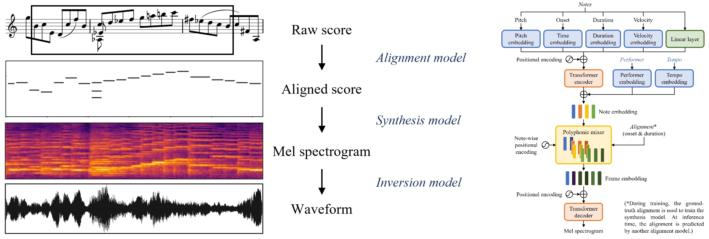

Deep Performer is a novel three-stage system for score-to-audio music performance synthesis. It is based on a transformer encoder-decoder architecture commonly used in text-to-speech synthesis. In order to handle polyphonic music inputs, we propose a new _polyphonic mixer_ for aligning the encoder and decoder. Moreover, we propose a new _note-wise positional encoding_ for providing a fine-grained conditioning to the model so that the model can learn to behave differently at the beginning, middle and end of a note.

Here are some audio samples synthesized by our proposed system.

| Violin | Piano |
|:-:|:-:|
|  |  |
|  |  |
|  |  |
|  |  |
|  |  |
