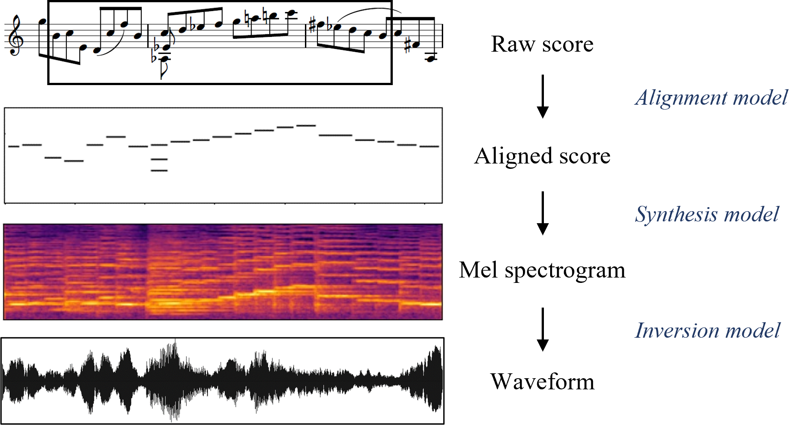
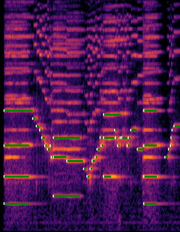
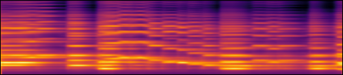
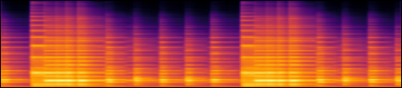
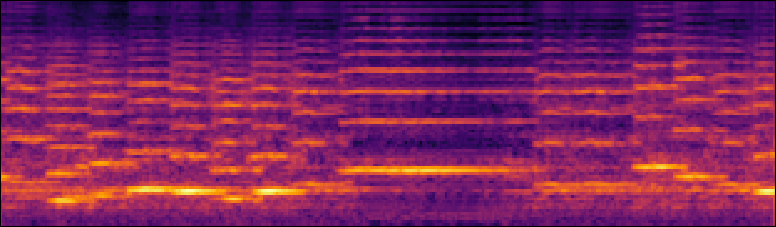
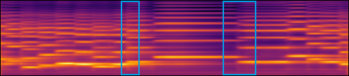
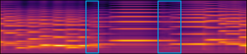

# Audios for the figures

These are the audios for the figures on the paper.

## Figure 1

An overview of the proposed three-stage pipeline for score-to-audio music performance synthesis.

{: style="max-height: 200px; width: auto;"}



## Figure 3

An example of the constant-Q spectrogram of the first 20 seconds of a violin recording and the estimated onsets (white dots) and durations (green lines).

{: style="max-height: 200px; width: 600px; max-width: 100%;"}



## Figure 5

Examples of the mel spectrograms, in log scale, synthesized by our proposed model for (a) violin and (c) piano. (b) and (d) show the input scores for (a) and (c), respectively.

| (a) | {: style="max-height: 100px; width: 600px; max-width: 100%;"} |
| (b) | {: style="max-height: 50px; width: 600px; max-width: 100%;"} |



| (c) | {: style="max-height: 100px; width: 600px; max-width: 100%;"} |
| (d) | {: style="max-height: 50px; width: 600px; max-width: 100%;"} |



## Figure 6

Examples of the mel spectrograms, in log scale, synthesized by (a) the baseline model, (b) our proposed synthesis model, and (d) our proposed synthesis model without the note-wise positional encoding. (c) and (e) show the waveforms for (b) and (d), respectively. (f) shows the input score.

| (a) | {: style="max-height: 100px; width: 600px; max-width: 100%;"} |



| (b) | {: style="max-height: 100px; width: 600px; max-width: 100%;"} |
| (c) | {: style="max-height: 50px; width: 600px; max-width: 100%;"} |



| (d) | {: style="max-height: 100px; width: 600px; max-width: 100%;"} |
| (e) | {: style="max-height: 50px; width: 600px; max-width: 100%;"} |


