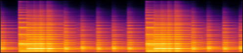

__Deep Performer: Score-to-Audio Music Performance Synthesis__
{:.center .larger}

[Hao-Wen Dong](https://salu133445.github.io/)<sup>1,2</sup> &emsp;
[Cong Zhou](https://www.linkedin.com/in/cong-zhou-93427426/)<sup>1</sup> &emsp;
[Taylor Berg-Kirkpatrick](https://cseweb.ucsd.edu/~tberg/)<sup>2</sup> &emsp;
[Julian McAuley](https://cseweb.ucsd.edu/~jmcauley/)<sup>2</sup>\\
<sup>1</sup> Dolby Laboratories &emsp;
<sup>2</sup> University of California San Diego\\
<span style="font-size: smaller;">\* Work done during an internship at Dolby</span>
{:.center}

 &emsp;
 &emsp;
 &emsp;
 &emsp;
 &emsp;

{:.center}



---

## Content

- [Best samples](#best-samples)
- [Datasets](#datasets)
- [Violin samples](#violin)
- [Piano samples](#piano)
- [Audios for the figures on the paper](#figures)
- [Citation](#citation)

---

## Best samples {#best-samples}

| Violin | Piano |
|:-:|:-:|
|  |  |
|  |  |
|  |  |
|  |  |
|  |  |

---

## Datasets {#datasets}

We used two datasets to train our proposed system: [Bach Violin Dataset](https://salu133445.github.io/bach-violin-dataset/) for the violin and [MAESTRO Dataset](https://magenta.tensorflow.org/datasets/maestro) for the piano.

The Bach Violin Dataset is a collection of high-quality public recordings of Bach’s sonatas and partitas for solo violin (BWV 1001–1006). The dataset consists of 6.5 hours of professional recordings from 17 violinists recorded in various recording setups. It also provides the reference scores and estimated alignments between the recordings and scores. Below is an example of the alignment provided, where white dots and green lines show the estimated note onsets and durations.




_For more information, please visit the project [website](https://salu133445.github.io/bach-violin-dataset/) for the Bach Violin Dataset._

---

## Violin samples {#violin}

> These are the violin samples used in the subjective listening test. We used the [Bach Violin Dataset](https://salu133445.github.io/bach-violin-dataset/) to train our models.

### (V1) Bach - Violin Partita no. 1 in B minor, BWV 1002, mov. 2 - Emil Telmányi

| Baseline                                     |  |
| Deep Performer (ours)                        |  |
| &emsp;- w/o note-wise positional encoding    |  |
| &emsp;- w/o performer embedding              |  |
| &emsp;- w/o encoder (using piano roll input) |  |

### (V2) Bach - Violin Partita no. 1 in B minor, BWV 1002, mov. 2 - Emil Telmányi

| Baseline                                     |  |
| Deep Performer (ours)                        |  |
| &emsp;- w/o note-wise positional encoding    |  |
| &emsp;- w/o performer embedding              |  |
| &emsp;- w/o encoder (using piano roll input) |  |

### (V3) Bach - Violin Partita No. 3 in E major, BWV 1006, mov. 1 - Emil Telmányi

| Baseline                                     |  |
| Deep Performer (ours)                        |  |
| &emsp;- w/o note-wise positional encoding    |  |
| &emsp;- w/o performer embedding              |  |
| &emsp;- w/o encoder (using piano roll input) |  |

### (V4) Bach - Violin Partita No. 3 in E major, BWV 1006, mov. 4 - Karen Gomyo

| Baseline                                     |  |
| Deep Performer (ours)                        |  |
| &emsp;- w/o note-wise positional encoding    |  |
| &emsp;- w/o performer embedding              |  |
| &emsp;- w/o encoder (using piano roll input) |  |

### (V5) Bach - Violin Partita No. 3 in E major, BWV 1006, mov. 7 - Oliver Colbentson

| Baseline                                     |  |
| Deep Performer (ours)                        |  |
| &emsp;- w/o note-wise positional encoding    |  |
| &emsp;- w/o performer embedding              |  |
| &emsp;- w/o encoder (using piano roll input) |  |

---

## Piano samples {#piano}

> These are the piano samples used in the subjective listening test. We used the [MAESTRO Dataset](https://magenta.tensorflow.org/datasets/maestro) to train our models.

### (P1) International Piano-e-Competition 2006

| Baseline                                     |  |
| Deep Performer (ours)                        |  |
| &emsp;- w/o note-wise positional encoding    |  |
| &emsp;- w/o performer embedding              |  |
| &emsp;- w/o encoder (using piano roll input) |  |

### (P2) International Piano-e-Competition 2008

| Baseline                                     |  |
| Deep Performer (ours)                        |  |
| &emsp;- w/o note-wise positional encoding    |  |
| &emsp;- w/o performer embedding              |  |
| &emsp;- w/o encoder (using piano roll input) |  |

### (P3) International Piano-e-Competition 2009

| Baseline                                     |  |
| Deep Performer (ours)                        |  |
| &emsp;- w/o note-wise positional encoding    |  |
| &emsp;- w/o performer embedding              |  |
| &emsp;- w/o encoder (using piano roll input) |  |

### (P4) International Piano-e-Competition 2011

| Baseline                                     |  |
| Deep Performer (ours)                        |  |
| &emsp;- w/o note-wise positional encoding    |  |
| &emsp;- w/o performer embedding              |  |
| &emsp;- w/o encoder (using piano roll input) |  |

### (P5) International Piano-e-Competition 2013

| Baseline                                     |  |
| Deep Performer (ours)                        |  |
| &emsp;- w/o note-wise positional encoding    |  |
| &emsp;- w/o performer embedding              |  |
| &emsp;- w/o encoder (using piano roll input) |  |

---

## Audios for the figures on the paper {#figures}

### Figure 1

An overview of the proposed three-stage pipeline for score-to-audio music performance synthesis.

{: style="max-height: 200px; width: auto;"}



### Figure 3

An example of the constant-Q spectrogram of the first 20 seconds of a violin recording and the estimated onsets (white dots) and durations (green lines).

{: style="max-height: 200px; width: 600px; max-width: 100%;"}



### Figure 5

Examples of the mel spectrograms, in log scale, synthesized by our proposed model for (a) violin and (c) piano. (b) and (d) show the input scores for (a) and (c), respectively.

| (a) | {: style="max-height: 100px; width: 600px; max-width: 100%;"} |
| (b) | {: style="max-height: 50px; width: 600px; max-width: 100%;"} |



| (c) | {: style="max-height: 100px; width: 600px; max-width: 100%;"} |
| (d) | {: style="max-height: 50px; width: 600px; max-width: 100%;"} |



### Figure 6

Examples of the mel spectrograms, in log scale, synthesized by (a) the baseline model, (b) our proposed synthesis model, and (d) our proposed synthesis model without the note-wise positional encoding. (c) and (e) show the waveforms for (b) and (d), respectively. (f) shows the input score.

| (a) | {: style="max-height: 100px; width: 600px; max-width: 100%;"} |



| (b) | {: style="max-height: 100px; width: 600px; max-width: 100%;"} |
| (c) | {: style="max-height: 50px; width: 600px; max-width: 100%;"} |



| (d) | {: style="max-height: 100px; width: 600px; max-width: 100%;"} |
| (e) | {: style="max-height: 50px; width: 600px; max-width: 100%;"} |



---

## Citation {#citation}

> Hao-Wen Dong, Cong Zhou, Taylor Berg-Kirkpatrick, and Julian McAuley, "Deep Performer: Score-to-Audio Music Performance Synthesis," _Proceedings of the IEEE International Conference on Acoustics, Speech and Signal Processing (ICASSP)_, 2022.

```bibtex
@inproceedings{dong2022deepperformer,
    author = {Hao-Wen Dong and Cong Zhou and Taylor Berg-Kirkpatrick and Julian McAuley},
    title = {Deep Performer: Score-to-Audio Music Performance Synthesis},
    booktitle = {Proceedings of the IEEE International Conference on Acoustics, Speech and Signal Processing (ICASSP)},
    year = 2022,
}
```
